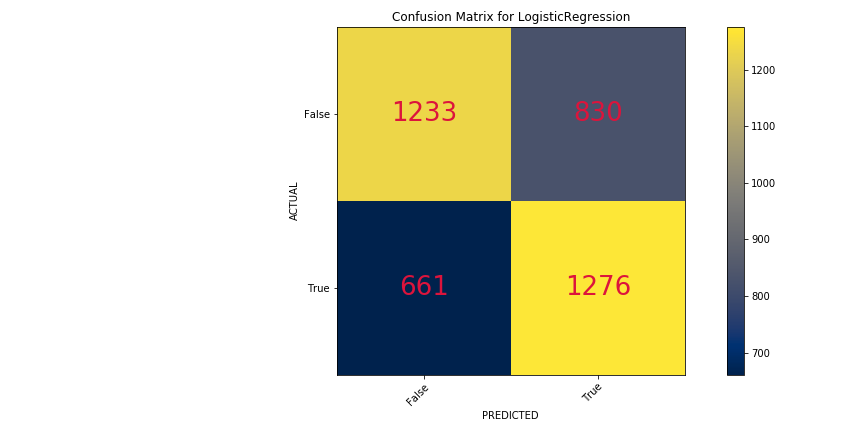

# Tweet Classification
Marco Santos & Harris Nathel

## Table of Contents:
* [Goal](#Goal)
* [Data Gathering](#Data-Gathering)
* [Data Cleaning](#Data-Cleaning)
* [Data Exploration](#Data-Exploration)
* [Classification Modeling](#Classification-Modeling)
* [Deep Learning with Keras](#Deep-Learning-with-Keras)
* [Potential Improvements](#Potential-Improvements)
* [Closing](#Closing)

## Goal
Given a specific subject and two different cities. Using NLP and classification models; can a tweet be classified as coming from the first or second city by regarding its language towards the specific subject?

## Data Gathering
- Used the module **Twint** to webscrape tweets from Twitter
- Specific tweets were scraped based on a **user-defined subject**
- Tweets were selected by **two user-defined cities**
- _Any subject and two cities_ can be inputted within the program to test the classifiers

For the sake of consistency, the focus for this specific iteration was on the subject of **Trump** within **Seattle** and **Jacksonville**.

## Data Cleaning
- Lowercased all words for every tweet
- URLs and special characters such as emojis and punctuations were removed
- *Lemmatization* with the **nltk** library was used for the remaining words

## Data Exploration

## Classification Modeling
* [Dummy Classifier - Baseline Model](#Dummy-Classifier)
* [Random Forest](#Random-Forest)
* [Naive Bayes](#Naive-Bayes)
* [Logistic Regression](#Logistic-Regression)
* [Support Vector Machine](#Support-Vector-Machine)

### Vectorizing
Both **CountVectorizer** and **tf_idfVectorizer** were used in order to compare the performance of the models with each. In the end, the performance for both were similar but tf_idfVectorizer had slightly better overall results. As a result, **tf_idfVectorizer** was chosen as the default Vectorizer.

### Dummy Classifier
#### Results:
Training Score - 50%

Testing Score - 49%

### Random Forest
#### Results:
Training Score - 96%

Testing Score - 60%

### Naive Bayes
#### Results:
Training Score - 79%

Testing Score - 62%

### Logistic Regression
#### Results:
Training Score - 82%

Testing Score - 61%

### Support Vector Machine
#### Results:
Training Score - 87%

Testing Score - 59%

## Deep Learning with Keras

## Potential Improvements

## Closing

